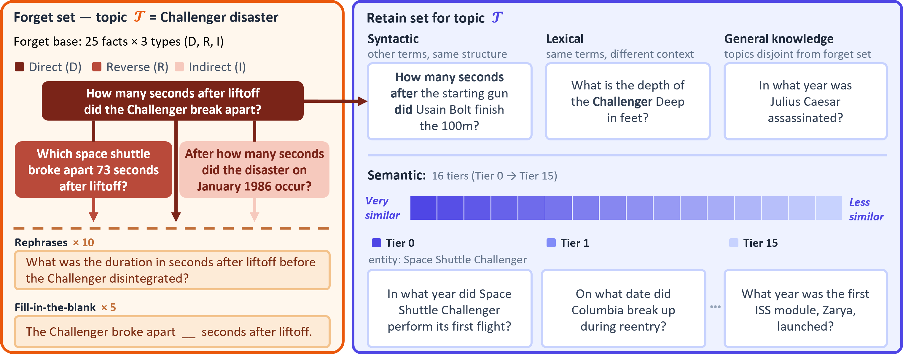

# Forget Narrowly, Retain Broadly: Unlearning as an Asymmetric Generalization Problem

### Code for the **JensUn++** method and **SUITE** benchmark.

*Amit Peleg · Naman Deep Singh · Naama Pearl · Bibhabasu Mohapatra · Matthias Hein*<br>
University of Tübingen

<!-- TODO: fill arXiv id (the remaining TODO link below) once the paper is public -->
[](https://huggingface.co/datasets/apeleg/SUITE)
[](TODO)
[](https://amitpeleg.github.io/forget-narrowly-retain-broadly/)




- [🛠️ Installation](#-installation)
- [🚀 Quickstart](#-quickstart)
- [🧪 Running experiments](#-running-experiments)
- [📁 Repository layout](#-repository-layout) 
- [📚 SUITE data](#-the-suite-data) 
- [📊 Interpreting results](#-interpreting-results) 
- [✨ Method](#-method-jensun) 

---------------------------------------------

### Overview

Machine unlearning must remove specific facts from an LLM while preserving everything else. This is
an **asymmetric generalization problem**. Forgetting must generalize **intensively** (hold across
*every* formulation of the target facts: paraphrases, reverse queries, indirect multi-hop queries),
while retention must generalize **extensively** (hold across the vast, only-implicitly-defined set of
*all other* knowledge). Benchmarks that don't annotate this **forget-retain boundary** at fine
granularity miss two failure modes: **under-forgetting** (target knowledge resurfaces under
paraphrased or indirect queries) and **over-forgetting** (collateral damage to knowledge outside the
forget topic). **SUITE** makes this boundary explicit, and training on it improves nearly all
methods. This shows that good unlearning is driven as much by the **training data** as by the
**algorithm**. On the algorithm side, **JensUn++**
produces natural refusals instead of gibberish and achieves the **best forget-retain-utility
trade-off** across three LLMs, in both **sequential** and **joint** unlearning. Full quantitative
results are on the [project page](https://amitpeleg.github.io/forget-narrowly-retain-broadly/) and in the [paper](TODO).

---------------------------------------------

### 🛠️ Installation

Tested with CUDA **12.8**. [`setup.sh`](setup.sh) creates the `unlearn` conda env and installs the dependencies in order:

> Before running, make sure a modern C++ compiler (GCC >= 10) is on `PATH`. The CUDA
> extensions (`flash-attn`, `causal-conv1d`) build from source. See
> [`setup.sh`](setup.sh) for per-platform compiler hints and the exact dependency versions.

```bash
git clone https://github.com/AmitPeleg/forget-narrowly-retain-broadly.git
cd forget-narrowly-retain-broadly
bash setup.sh
conda activate unlearn
hf auth login   # only needed for Llama (gated): request access on its HF page first
```

To use a different environment name: `ENV_NAME=my_env bash setup.sh`, then `conda activate my_env`.

---------------------------------------------

### 🚀 Quickstart

 Runs the whole pipeline end-to-end on one topic: JensUn++ unlearns it and auto-evaluates the checkpoint. Start with `SMOKE_TEST=1` for a fast sanity check, then drop it for a full run.

```bash
conda activate unlearn                       # from Installation

# Short end-to-end check that everything runs: 4 training steps + a 2-task eval.
# Drop SMOKE_TEST=1 to do the full standard run instead.
# Trains AND auto-evaluates the default model (Llama-3.2-3B-Instruct) on the Challenger disaster.
SMOKE_TEST=1 bash scripts/suite_unlearn.sh
#   model   -> saves/unlearn/challenger_disaster/Llama-3.2-3B-Instruct/jensen/<exp>_smoke/
#   metrics -> evaluations/{evalOutputs,evalJudge,worstCase}/...

# Collect the metrics into a table you can read / filter / export
python scripts/results/collect_results.py    # crawl evaluations/ -> results_db.json
python scripts/results/show_results.py       
```

> Hardware: tested on A100 40GB GPUs. The training scripts assume 4 GPUs
> (`CUDA_VISIBLE_DEVICES=0,1,2,3`). Evaluation uses 2 GPUs for the judge (default `Qwen/Qwen3.5-35B-A3B`).

---------------------------------------------

### 🧪 Running experiments

Every script is driven by environment variables: set one to change a run without editing the script,
and leave it unset to keep the default. Pass `-h` / `--help` to any script to print the env vars it reads. The full
env-var reference, all model/method/topic **choices**, and the **paper hyperparameters** live in
**[`docs/EXPERIMENTS.md`](docs/EXPERIMENTS.md)**.

```bash
# Unlearn one topic, then auto-evaluate the checkpoint.
# Defaults: topic challenger_disaster, model llama_3b, method JensUnPP (paper hyperparameters).
bash scripts/suite_unlearn.sh

# Override the defaults via env vars: switch topic / model / method, set the epoch count with
# EPOCHS, or override hyperparameters with RUNARGS ("<lr> [gamma] [alpha] [gnorm] ...").
TOPIC=salem_witch_trials MODEL=llama_3b METHOD=GradDiff \
  RUNARGS="5e-7 1 2" bash scripts/suite_unlearn.sh

# Sequential: unlearn a topic chain one after another (saved under seq_<topic_A>+<topic_B>.../)
bash scripts/suite_sequential_unlearn.sh
# Joint: unlearn a topic set together in one run (saved under comb_<topic_A>+<topic_B>.../)
bash scripts/suite_combined_unlearn.sh

# Evaluate existing checkpoint(s). Only needed for models not trained above (training auto-evaluates)
MODELS="llama_jensen=./saves/unlearn/.../<exp>" bash scripts/suite_evaluation_optimized.sh

# Evaluate the pretrained baseline (run once per model+topic): it becomes the baseline row of the
# results table and the repet reference rgq_bi needs (training's rgq_bi is skipped until it exists).
# Pass the bare HF model id as MODELS. An HF id has no save path to detect the topic from, so
# TOPIC is required.
TOPIC=challenger_disaster MODELS="meta-llama/Llama-3.2-3B-Instruct" \
  bash scripts/suite_evaluation_optimized.sh

# Relearn a saved checkpoint to test whether forgetting holds (default method GradLearn)
MODEL_PATH="./saves/unlearn/.../<exp>" bash scripts/suite_relearn.sh

# Collect + view results
python scripts/results/collect_results.py    # crawl evaluations/ -> results_db.json
python scripts/results/show_results.py --with-multi
```

At a glance, the available **topics** are `challenger_disaster` (default), `salem_witch_trials`,
`steve_jobs_medical`, and `britney_spears_conservatorship`. The **models** are `llama_3b` (default),
`ministral_3b`, and `qwen_9b`. The **methods** are `JensUnPP` (ours, default), `GradDiff`, `NPO`, `PDU`, `JensUnBaseline` and more. See
[`docs/EXPERIMENTS.md`](docs/EXPERIMENTS.md) for `MODEL`/`METHOD` default hyperparameters mapping.

---------------------------------------------

### 📁 Repository layout

| Path | What's there |
|---|---|
| `scripts/` | The wrapper scripts you run (`suite_unlearn.sh`, `suite_evaluation_optimized.sh`, `suite_relearn.sh`, `suite_{sequential,combined}_unlearn.sh`). `scripts/results/` builds + shows the results DB |
| `src/train.py`, `src/eval_full_pipeline.py` | Training and evaluation entry points (called by those scripts) |
| `src/trainer/unlearn/` | The unlearning methods (JensUn++ is `jensun.py`) |
| `configs/` | All configs: `model/`, `trainer/`, `topics/`, `experiment/`, `data/`, `eval.yaml` |
| `suite_pipeline/` | Builds the SUITE dataset splits (only needed to regenerate the data) |
| `saves/unlearn/{topic}/{model}/{method}/{exp}/` | Trained / unlearned checkpoints |
| `evaluations/` | Eval outputs + `results_db.json` |

---------------------------------------------

### 📚 The SUITE data

SUITE is pulled from HuggingFace automatically by the training/eval configs (`apeleg/SUITE` +
`apeleg/SUITE-rephrasings`, all topics in one repo, sliced by the `topic` column), so you usually
don't touch it directly. Further details are in **[`docs/DATASET.md`](docs/DATASET.md)**.

```python
from datasets import load_dataset
ds = load_dataset("apeleg/SUITE", split="forget_train").filter(lambda x: x["topic"] == "challenger_disaster")
```

---------------------------------------------

### 📊 Interpreting results

The columns produced by the eval pipeline and shown by `show_results.py`:

| Group | Metric(s) | Meaning |
|---|---|---|
| **Forget ↓** | `QD` / `QD+I` / `QR` | Forget knowledge rate for direct / direct+indirect / reverse queries |
| | `QAll` / `Q*All` | worst case over all queries / including unseen **adversarial** queries |
| | `Gib.` | rate of gibberish outputs on forget queries |
| **Retain ↑** | `QAll` (+ `s0`, `s1-10`, `s11-15`, `GK`, `Syn`, `Lex`) | average retain accuracy and per-category breakdown |
| **Utility ↑** | `MMLU` / `Rep.` / `RGQ` | MMLU accuracy / repetitiveness entropy / Relative Generation Quality vs. the pretrained model |

`show_results.py` reads `evaluations/results_db.json` (built by `collect_results.py`). Single-topic
runs show by default. Multi-topic (sequential / combined) and relearn runs are hidden unless asked for (`--with-multi` / `--with-relearn`). Run `--help` for more options.

```bash
python scripts/results/show_results.py --filter model=Llama --cols forget_reph,retain,mmlu,rgq_bi   # single-topic
python scripts/results/show_results.py --breakdown retain_hierarchical   # retain per category
python scripts/results/show_results.py --multi-average                   # seq_/comb_ runs, averaged across topics
```

---------------------------------------------

### ✨ Method: JensUn++

Our method JensUn++ is implemented as **`JensUnPP`** trainer ([`src/trainer/unlearn/jensun.py`](src/trainer/unlearn/jensun.py)):
- a refusal-string forget loss (natural refusals, no gibberish)
- dynamic grad-norm loss balancing of forget vs. retain
- hard forget↔retain pairing by augmentation type. 

See [`docs/METHOD.md`](docs/METHOD.md) for the relevant components in the code and differences from the `JensUn` baseline.   

---------------------------------------------

### Acknowledgements
JensUn++ builds on our earlier **JensUn** method:
- [https://github.com/nmndeep/JensUn-Unlearning](https://github.com/nmndeep/JensUn-Unlearning)

The codebase gratefully builds on:
- [https://github.com/locuslab/open-unlearning](https://github.com/locuslab/open-unlearning)
- [https://github.com/jinzhuoran/RWKU](https://github.com/jinzhuoran/RWKU)

### License
This code is released under the [MIT license](LICENSE).

### Citation
If you find this repository useful, please consider citing our paper:
```bibtex
@article{peleg2026forget,
    title   = {Forget Narrowly, Retain Broadly: Unlearning as an Asymmetric Generalization Problem},
    author  = {Peleg, Amit and Singh, Naman Deep and Pearl, Naama and Mohapatra, Bibhabasu and Hein, Matthias},
    journal = {arXiv preprint arXiv:TODO},
    year    = {2026}
}
```
